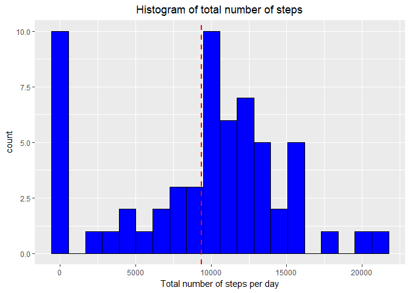
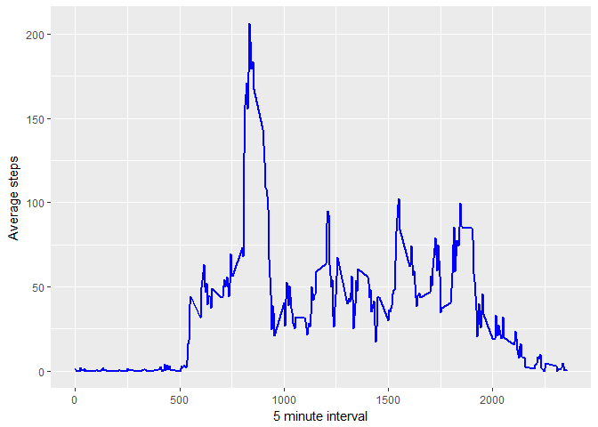
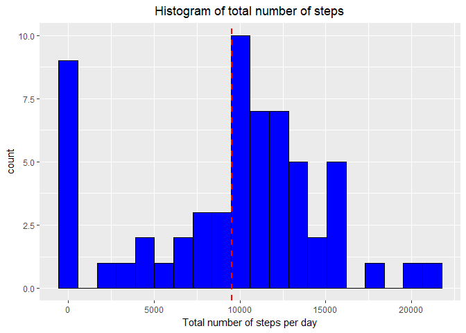
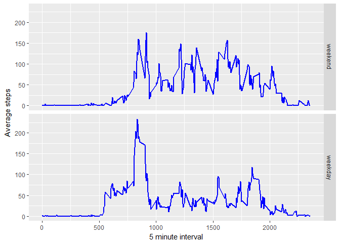

# Reproducible Research: Peer Assessment 1


## Loading and preprocessing the data


```r
activity<-read.csv("activity.csv",header=TRUE,na.strings="NA")
# The date is formatted as Date
activity$date<-as.Date(as.character(activity$date),"%Y-%m-%d")
```

## What is mean total number of steps taken per day?
The missing values in the dataset are ignored for this part of the assignment. The histogram of the data is shown below.


```r
library(dplyr,warn.conflicts = FALSE)
# the dplyr package is used to summarize the total steps per day
plot1<-activity%>% group_by(date)%>%summarise(totalsteps=sum(steps,na.rm=TRUE))
library(ggplot2)
ggplot(plot1, aes(x=totalsteps)) + 
  geom_histogram(bins=20, colour="black", fill="blue")+
  geom_vline(aes(xintercept = mean(totalsteps)),colour="red",size=1,linetype=2)+
  xlab("Total number of steps per day")+
  ggtitle("Histogram of total number of steps")+
  theme(plot.title = element_text(hjust = 0.5))
```

<!-- -->


Summary of the total number of steps taken per day:

```r
summary(plot1$totalsteps)
```

```
##    Min. 1st Qu.  Median    Mean 3rd Qu.    Max. 
##       0    6778   10400    9354   12810   21190
```

## What is the average daily activity pattern?


```r
plot2<-activity%>%group_by(interval)%>%summarize(avsteps=mean(steps,na.rm=TRUE))
ggplot(data=plot2,aes(x=interval,y=avsteps))+
  geom_line(colour="blue",size=1)+
  ylab("Average steps")+
  xlab("5 minute interval")
```

<!-- -->

The 5-minute interval, on average across all the days in the dataset, that 
contains the maximum number of steps is: 


```r
plot2$interval[which.max(plot2$avsteps)]
```

```
## [1] 835
```

## Imputing missing values

The number of missing values in the dataset


```r
 apply(is.na(activity),2,sum)
```

```
##    steps     date interval 
##     2304        0        0
```

The missing values in the dataset are replaced by the mean for the 5 minute interval


```r
activity2<-activity
activity2[is.na(activity2$steps),1]<-plot2[which(plot2$interval==activity2[is.na(activity2$steps),3]),2]
```
The histogram of the mean total number of steps taken per day (after replacing the "NAs") is shown below.


```r
plot3<-activity2%>% group_by(date)%>%summarise(totalsteps=sum(steps,na.rm=TRUE))
ggplot(plot3, aes(x=totalsteps)) + 
  geom_histogram(bins=20, colour="black", fill="blue")+
  geom_vline(aes(xintercept = mean(totalsteps)),colour="red",size=1,linetype=2)+
  xlab("Total number of steps per day")+
  ggtitle("Histogram of total number of steps")+
  theme(plot.title = element_text(hjust = 0.5))
```

<!-- -->

Summary of the total number of steps taken per day:

```r
summary(plot3$totalsteps)
```

```
##    Min. 1st Qu.  Median    Mean 3rd Qu.    Max. 
##       0    7047   10440    9531   12810   21190
```

There is a small difference in the mean and median of the dataset after replacing the NAs.
The median changes from 10395 to  10439, 
while the mean changes from 9354 to 9530.
There is a slight increase in the total number of steps per day for the days with missing data.

## Are there differences in activity patterns between weekdays and weekends?


```r
weekend<-c("Sat","Sun")
activity2<-activity2%>% mutate(wkend=factor(weekdays(date,abbreviate=TRUE)%in%weekend,
                                 levels=c(TRUE,FALSE),labels=c("weekend","weekday")))

plot4<-activity2%>%group_by(interval,wkend)%>%summarize(avsteps=mean(steps,na.rm=TRUE))
ggplot(data=plot4,aes(x=interval,y=avsteps))+
  geom_line(colour="blue",size=1)+facet_grid(wkend~.)+
  ylab("Average steps")+
  xlab("5 minute interval")
```

<!-- -->

